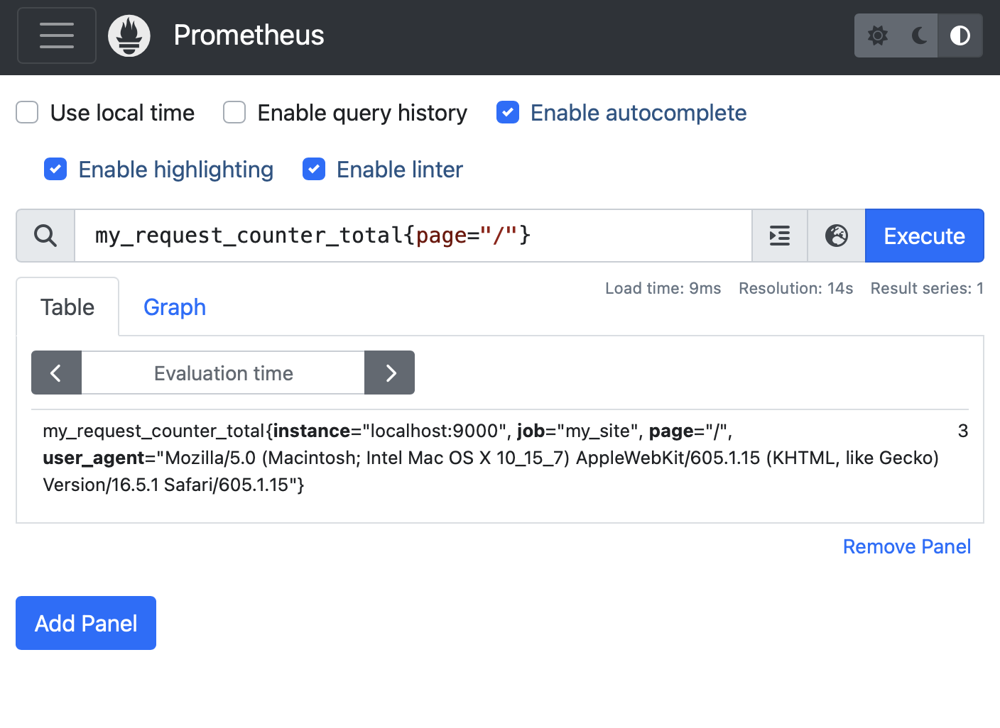

# Sample PlayFramework / Prometheus application

This application demonstrates how to use Prometheus with Play.

Prometheus is a monitoring framework that collects metrics from applications. It is a pull-based system, where the application exposes an HTTP endpoint that Prometheus polls to collect metrics. The endpoint is usually `/metrics` (see the **routes** file.)

The application contains a sample counter called **RequestCounter** that we use to count the number of requests and keep track of the endpoint visited, and the browser used. The counter is incremented in the **HomeController**.

Prometheus is initialized in **AppModule** by:

* Instantiating a CollectorRegistry and registering it as the default registry.
* Instantiating the PrometheusController.

The default registry will be used automatically by the **RequestCounter.requestCounter** when the instance is created.

## Pre-requisites

* Java 11
* Prometheus: `brew install prometheus`. Do not run it as a service.

## Dependencies

* Prometheus: 
```
"io.prometheus" % "simpleclient" % "0.16.0",
"io.prometheus" % "simpleclient_httpserver" % "0.16.0"
```

## Running the application

* Run the application: `sbt run`
* Run Prometheus: `prometheus` from the project directory too in a separate terminal window.

Prometheus will use the configuration in `prometheus.yml` to scrape the application. You can view the metrics at http://localhost:9090/

Once the application is running, visit http://localhost:9000/ and refresh the page a few times to generate some metrics.

Wait about **15 seconds** for Prometheus to scrape the application.

Then from the [Prometheus UI](http://localhost:9090), enter the following query to view the metrics:

```
my_request_counter_total{page="/"}
```

* **my_request_counter_total** is the name of the metric, generated from the name of the counter defined in **RequestCounter.requestCounter**.
* **page** is one of the labels that we defined in in **RequestCounter.requestCounter**.


